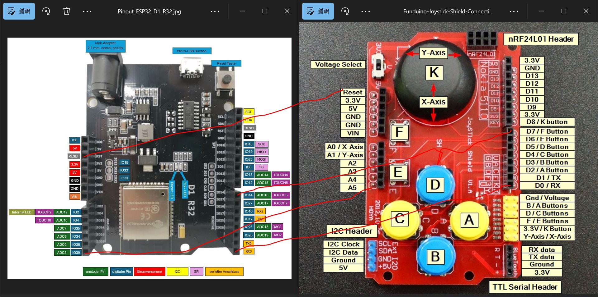

# Arduino_UNO_joystick_shield_testing
Joysitck shield or clone, schematic, collection
  
ref:https://draeger-it.blog/en/micropython-with-esp32-introduction-to-the-esp32-d1-r32/

### firmware for ESP32 and UNO (ATmega328p)
baud 500000 (0.5MHz), N81
UNO firmware, A0 = X, A1 = Y, D8 = joystick button-K (key), V-switch set to 5V
ESP32 D1_R32 firmware, IO-2 = X, IO-4 = Y, IO-12 = joystick button-K (key), V-switch set to 3V

### schematic and wiring diagram
ref:  
https://protosupplies.com/product/funduino-joystick-shield-v1-a/  
https://cb-electronics.com/products/ky-023-shield/  
  

### code for testing

  
