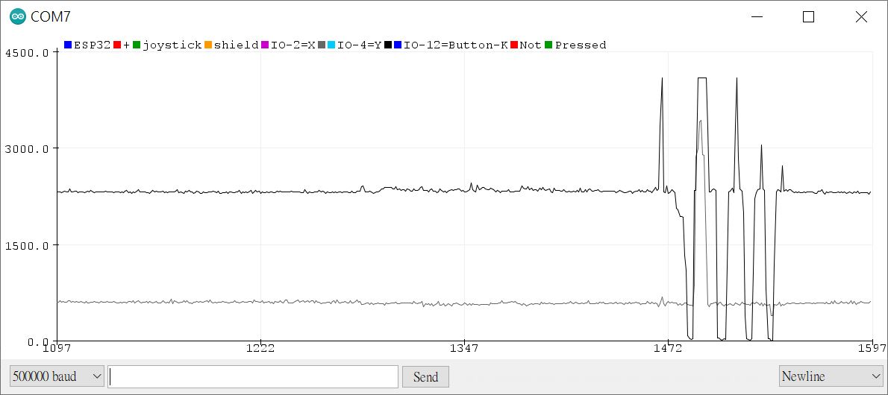

# Arduino_UNO_joystick_shield_testing

### known issue ESP32  


ESP32_D1_R32 has LED connected to IO-2 (see https://github.com/xiaolaba/ESP32_WeMos_D1_R32_IO2_Blink), and/or internal pull-down   
X-axis of joystick shiled is connected to IO-2, the variable resitor is paralleled, thus ADC read out is not full-scale to be 3.3v or 4096 steps.
Y-axis is is connected to IO-4, no such issue.  

UNO (AVR), X / Y read out more straightforward, no such issue.   
   

### Joysitck shield or clone, schematic, collection
  
ref:https://draeger-it.blog/en/micropython-with-esp32-introduction-to-the-esp32-d1-r32/

### firmware for ESP32 and UNO (ATmega328p)
baud 500000 (0.5MHz), N81  
UNO firmware, pins
```
A0 = X  
A1 = Y  
D8 = joystick button-K (key)  
V-switch set to 5V  
```

ESP32 D1_R32 firmware, pins
```
IO-2 = X  
IO-4 = Y  
IO-12 = joystick button-K (key)  
V-switch set to 3V  
```

### schematic and wiring diagram
ref:  
https://protosupplies.com/product/funduino-joystick-shield-v1-a/  
https://cb-electronics.com/products/ky-023-shield/  
  


### code for testing


  
